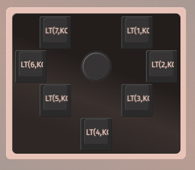

# The published data are as follows.

- # **Sunflower**

  #### **#000 XIAO RP2040** ([en](sunflower/buildguide_sunflower_001_en.md), [jp](sunflower/buildguide_sunflower_001_jp.md))

  

**※ VIA version created by [ykz89](https://github.com/ykz89/qmk_firmware/tree/sunflower)**
