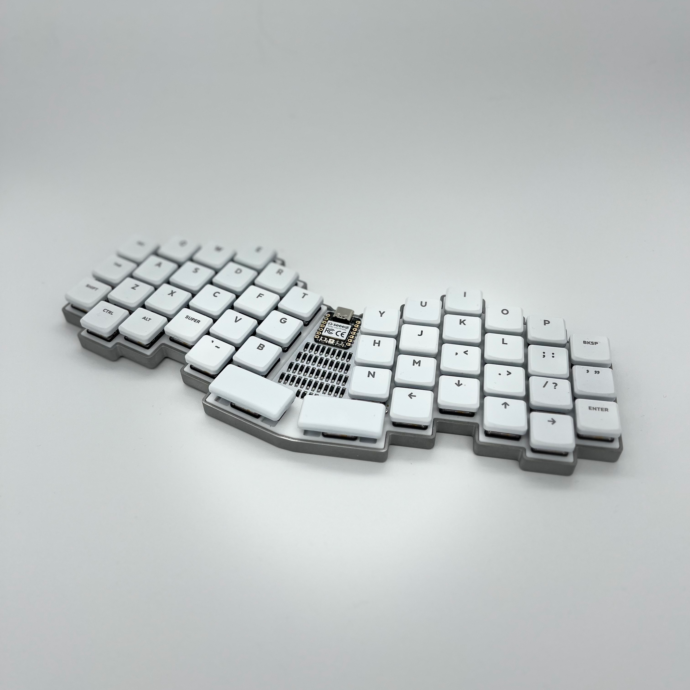
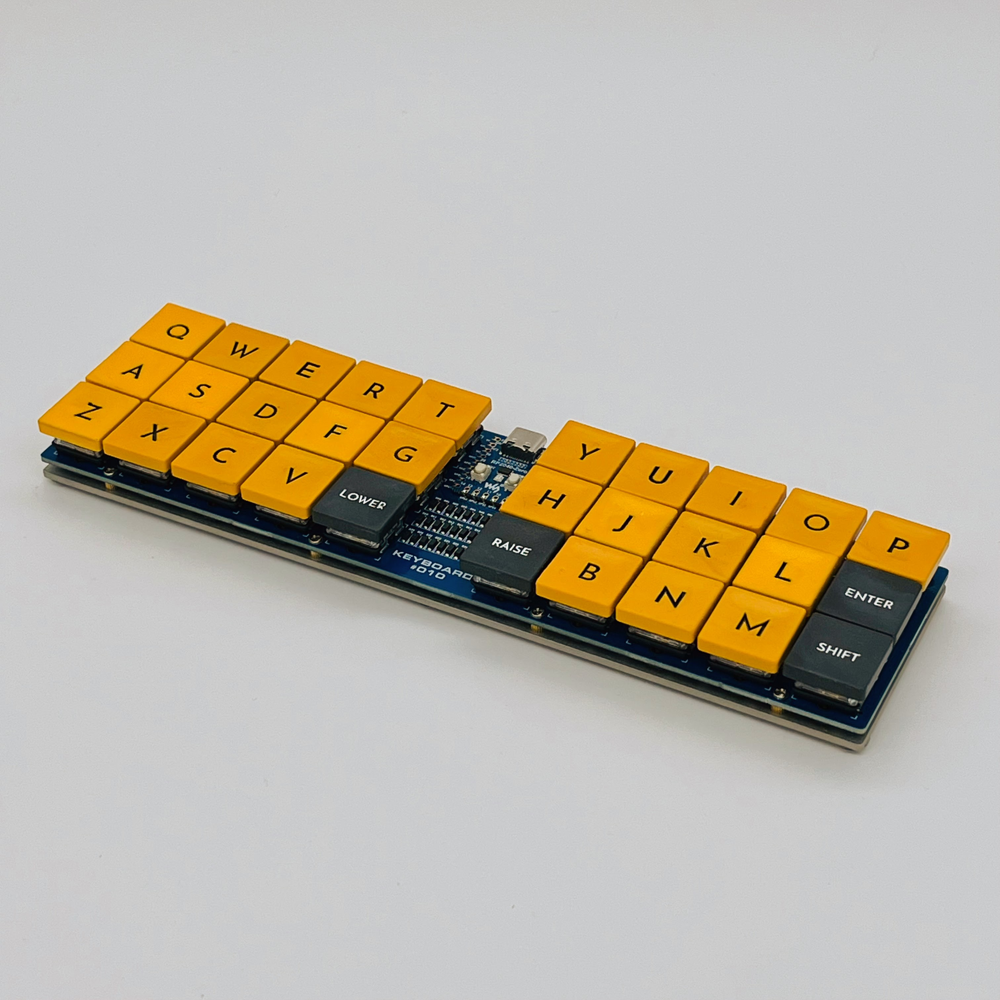
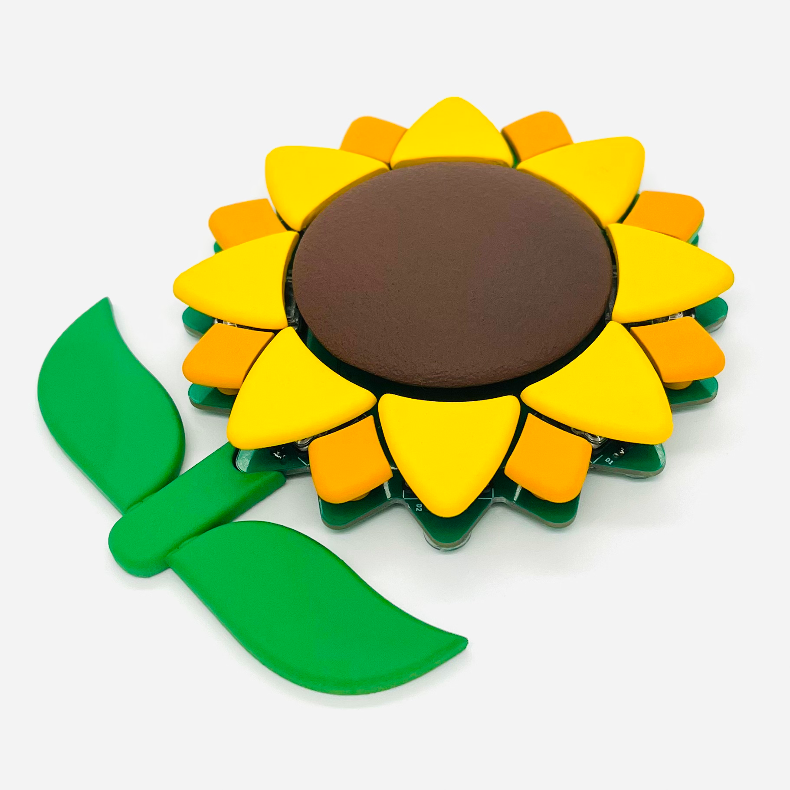

# The published data are as follows.

- # **Keyboard:**

  - #### **KEYBOARD #011 ([Source](keyboard/011))**

- #### **KEYBOARD #010 ([Source](keyboard/010))**

# **鎌倉宮 獅子頭**

#### **Kamakura-gū Lion Head #000 XIAO RP2040** ([en](lion_head/buildguide_lion_head_000_en.md), [jp](lion_head/buildguide_lion_head_000_jp.md))

# **Sunflower**

#### **#000 XIAO RP2040** ([en](sunflower/buildguide_sunflower_001_en.md), [jp](sunflower/buildguide_sunflower_001_jp.md))

# **MacroPad:** 

- #### **MacroPad #000 XIAO RP2040 ([en](macropad/macropad_000_xiao_rp2040_en.md), [jp](macropad/macropad_000_xiao_rp2040_jp.md))**

  
