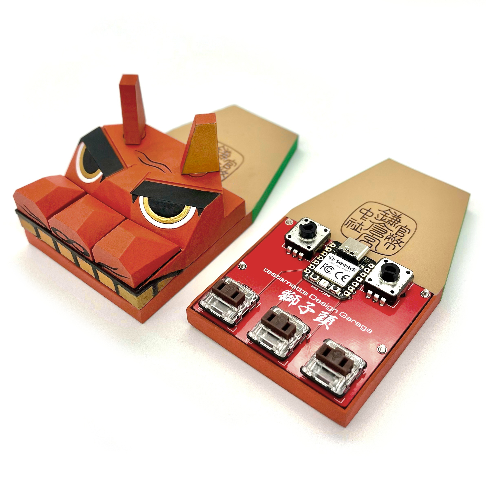
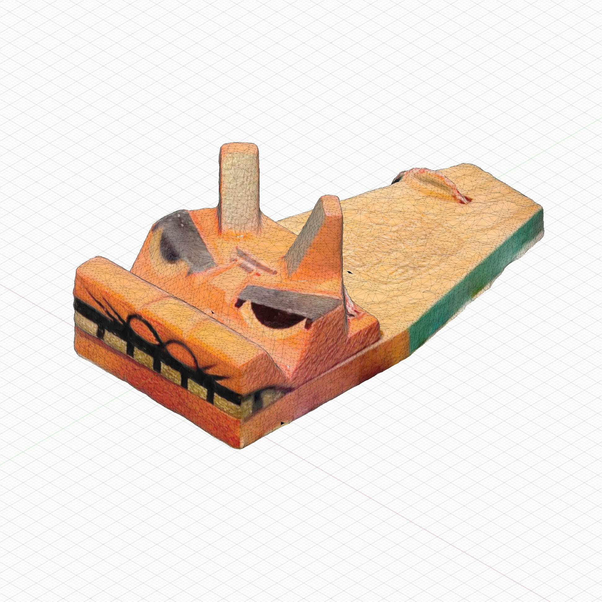
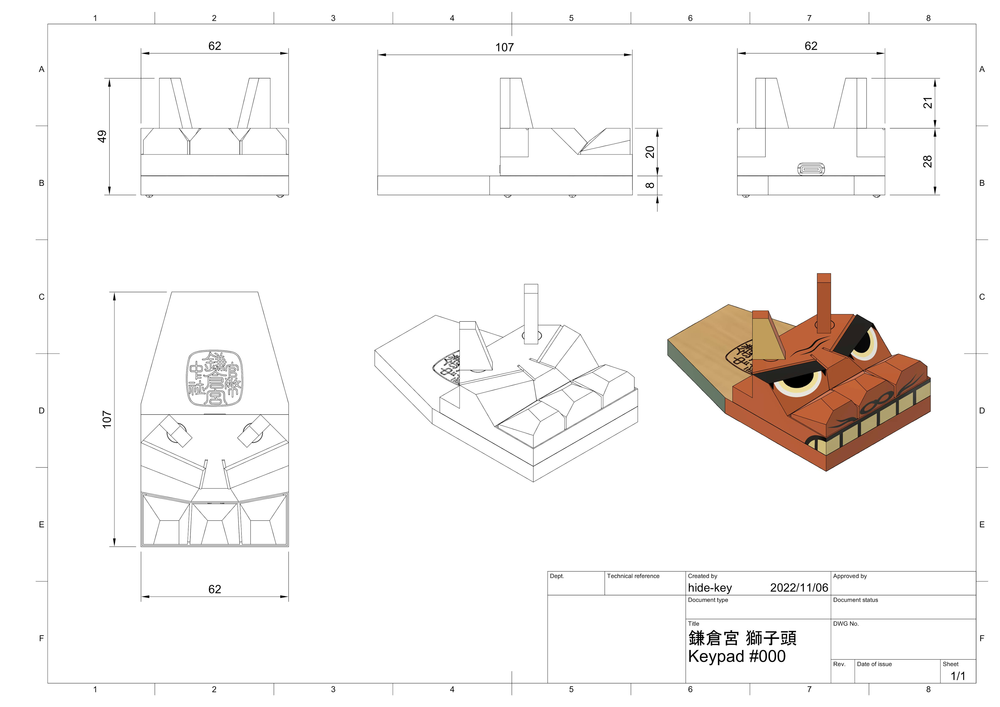
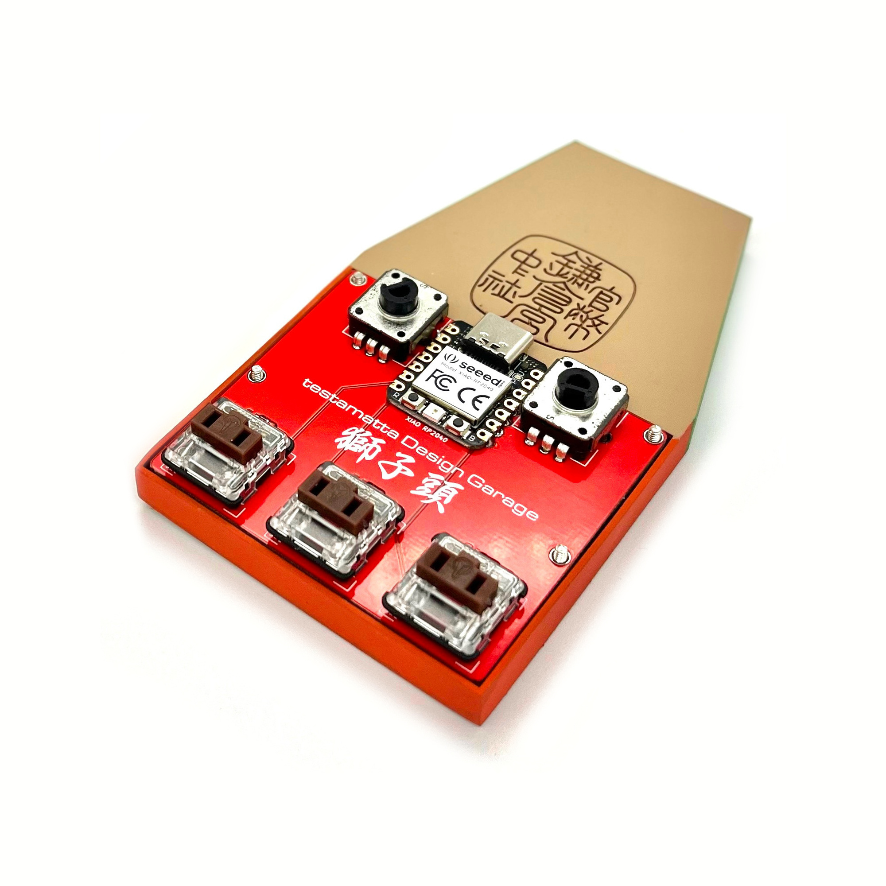

# 鎌倉宮 獅子頭(Kamakura-gū Lion Head) #000 XIAO RP2040 Build Guide

*I am using a translation tool. Please contact me if you have any problems.

※日本語版は[コチラ](buildguide_lion_head_000_jp.md)

[TOC]

A [神社](https://ja.wikipedia.org/wiki/%E7%A5%9E%E7%A4%BE) ([Shinto shrine](https://en.wikipedia.org/wiki/Shinto_shrine)) is a religious facility based on the beliefs of [神道](https://ja.wikipedia.org/wiki/%E7%A5%9E%E9%81%93) ([Shinto](https://en.wikipedia.org/wiki/Shinto)), a religion unique to Japan. Each shrine has its own amulet, and one of those shrines, the [鎌倉宮](https://ja.wikipedia.org/wiki/%E9%8E%8C%E5%80%89%E5%AE%AE) ([Kamakura-gū](https://en.wikipedia.org/wiki/Kamakura-g%C5%AB)) amulet, was in my house.

One day, I was looking around the room, wondering if there was anything interesting.🤔 Since I started making my own keyboards, various things have come to look like keyboards. It's some kind of sickness.  "Huh? The nose part of this amulet looks like a keycap?"😅

That is the 獅子頭 (Lion head) amulet, which is the motif of this time.

<u>*獅子頭 (Lion head) refers to the head of a [獅子舞](https://ja.wikipedia.org/wiki/%E7%8D%85%E5%AD%90%E8%88%9E) ([Lion dance](https://en.wikipedia.org/wiki/Lion_dance)). [獅子舞](https://ja.wikipedia.org/wiki/%E7%8D%85%E5%AD%90%E8%88%9E) ([Lion dance](https://en.wikipedia.org/wiki/Lion_dance)) is one of the traditional performing arts seen in East Asia and Southeast Asia, in which [獅子](https://ja.wikipedia.org/wiki/狛犬) ([Komainu](https://en.wikipedia.org/wiki/Komainu)) dance to the [祭囃子](https://ja.wikipedia.org/wiki/祭囃子) (accompaniment of festival music).</u>

I immediately started working on a 3D printed prototype, but the lion head motif is a talisman. I thought it would be impossible to complete it without permission. So, after the prototype was completed, I made an appointment with the [宮司](https://ja.wikipedia.org/wiki/%E5%AE%AE%E5%8F%B8) (chief priest) of the [鎌倉宮](https://ja.wikipedia.org/wiki/%E9%8E%8C%E5%80%89%E5%AE%AE) ([Kamakura-gū](https://en.wikipedia.org/wiki/Kamakura-g%C5%AB)), met in person, and said, "Please let me make a lion-headed amulet as a self-made keyboard." In addition, I was able to talk about various things, and I was able to hear a lot of stories. As a conclusion, I was able to get a willing consent and started full-scale production.

## ■Design

There are several types of this 獅子頭 (Lion head) amulet, but I mainly used the large size as a reference.

First, in order to obtain silhouette information, we used 3D scanning with [Photogrammetry](https://en.wikipedia.org/wiki/Photogrammetry). I scanned with my smartphone and the size of the scanned object was small, so it turned out to be quite rough. But it's good enough because we got the approximate silhouette information. In addition, I searched for [images on the Internet](https://www.google.com/search?q=%E7%8D%85%E5%AD%90%E9%A0%AD+%E3%81%8A%E5%AE%88%E3%82%8A&tbm=isch&ved=2ahUKEwi5k_WB-s_7AhVWxGEKHa5pA2IQ2-cCegQIABAA&oq=%E7%8D%85%E5%AD%90%E9%A0%AD&gs_lcp=CgNpbWcQARgBMgQIIxAnMgQIIxAnMgUIABCABDIFCAAQgAQyBQgAEIAEMgUIABCABDIFCAAQgAQyBQgAEIAEMgUIABCABDIFCAAQgARQAFgAYL0SaABwAHgAgAFNiAFNkgEBMZgBAKoBC2d3cy13aXotaW1nwAEB&sclient=img&ei=kC2EY7mLC9aIhwOu042QBg&bih=809&biw=1470) and supplemented the silhouette information.

The final size was designed to match the size of the key switch and rotary encoder.

## ■Parts needed

Prepare the following parts.

|      Name      |       Model        | Quantity |
| :------------: | :----------------: | :------: |
|      MCU       |    XIAO RP2040     |  1 pcs   |
|   Key switch   | Kailh Low Profile  |  3 pcs   |
|     Diode      |       1N4148       |  3 pcs   |
| Rotary encoder |    EC12E2440301    |  2 pcs   |
|     Screw      |      M2 10mm       |  4 pcs   |
| Cushion rubber | 7.9x2.2mm Circular |  4 pcs   |

*There is no problem with through-hole or SMD diodes.

## ■3D data

The model data (STL) are shown below.

- **STL data :** https://github.com/hide-key/testamatta/tree/main/lion_head/model_data/stl

## ■3D printing

Print the aforementioned 3D data. I output with the stereolithography method (SLA). You may also want to use a print service.

## ■Painting

Paint as desired. The basic procedure for the painting I did was "Surfacer → File → Surfacer → Paint color → Matte clear".

## ■Circuit board data

Below is the gerber file. Place your order with PCB Fabrication Services.

- **Gerber file :** https://github.com/hide-key/testamatta/blob/main/lion_head/pcb/lion_head_000.zip

  

## ■Firmware

Below are UF2 file, JSON file, and source files.

- **UF2 file :** https://github.com/hide-key/testamatta/blob/main/lion_head/uf2/testamatta_lion_head_000_xiao_rp2040_default.uf2
- **JSON file :** https://github.com/hide-key/testamatta/blob/main/lion_head/json/lion_head_000_xiao_rp2040.json
- **Source files :** https://github.com/hide-key/testamatta/tree/main/lion_head/000/xiao_rp2040

If you want to use UF2 file, boot XIAO RP2040 in bootloader mode and upload the downloaded UF2 file.

*Connect the XIAO RP2040 and the work PC with a USB cable, and press the RESET button while pressing the BOOT button. It will be recognized as a drive, so drag and drop the UF2 file. Once uploaded, it will be unmounted and reconnected automatically.

After that, use [**REMAP**](https://remap-keys.app/) to make your favorite keymap.

## ■Assembling

After assembling the circuit board and keyboard parts, we will install other parts.

**Points to note：**

- XIAO RP2040 is designed to be directly attached to the PCB. (No pin headers or cons throughs are used)

## ■Completing

Once the firmware has been written and the assembly is completed, it is completed.

## ■At the end

I am also posting on the following SNS.

- **Twitter** : https://twitter.com/nakahide2nd/status/1609593832911536129?s=20&t=q5LzWc66tWL6_BrWK2t76A

- **Instagram** : https://www.instagram.com/p/Cm4UbsKvuOh/?utm_source=ig_web_copy_link

- **Reddit** : [https://www.reddit.com/r/MechanicalKeyboards/comments/100nt7v/鎌倉宮_獅子頭kamakuragū_lion_head_000_xiao_rp2040i/?utm_source=share&utm_medium=web2x&context=3](https://www.reddit.com/r/MechanicalKeyboards/comments/100nt7v/鎌倉宮_獅子頭kamakuragū_lion_head_000_xiao_rp2040i/?utm_source=share&utm_medium=web2x&context=3)

- **instructables** : [https://www.instructables.com/Keypad鎌倉宮-獅子頭Kamakura-gū-Lion-Head-000-XIAO-RP2040/](https://www.instructables.com/Keypad鎌倉宮-獅子頭Kamakura-gū-Lion-Head-000-XIAO-RP2040/)

  

I would like to express my heartfelt gratitude to all those involved in the Kamakura Palace for their understanding and willing consent despite the sudden request.

Thank you very much for reading to the end.

Have a nice keyboard life.