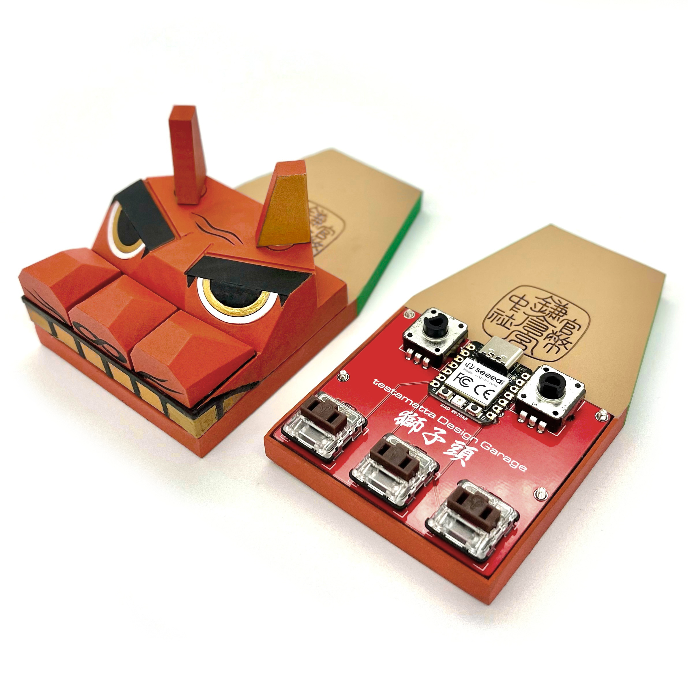
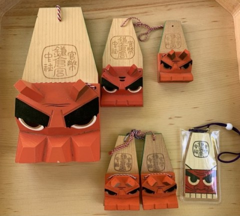
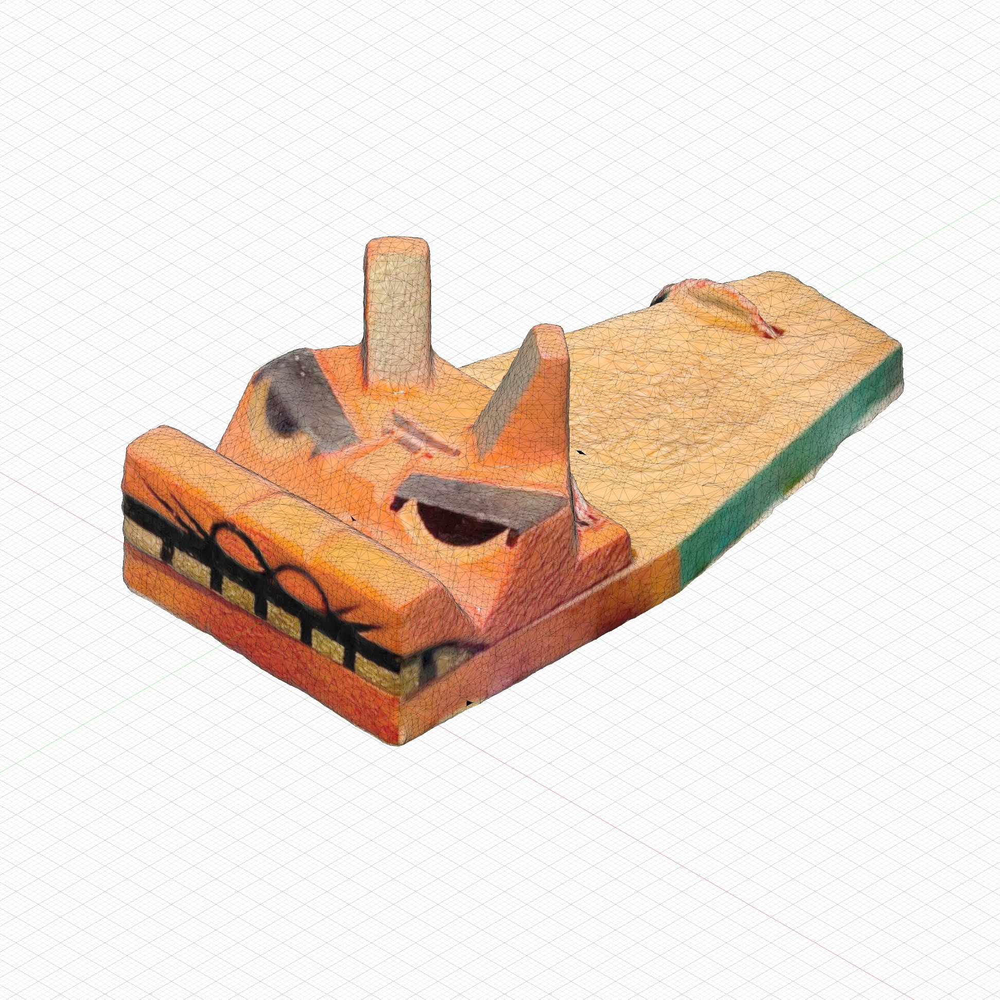
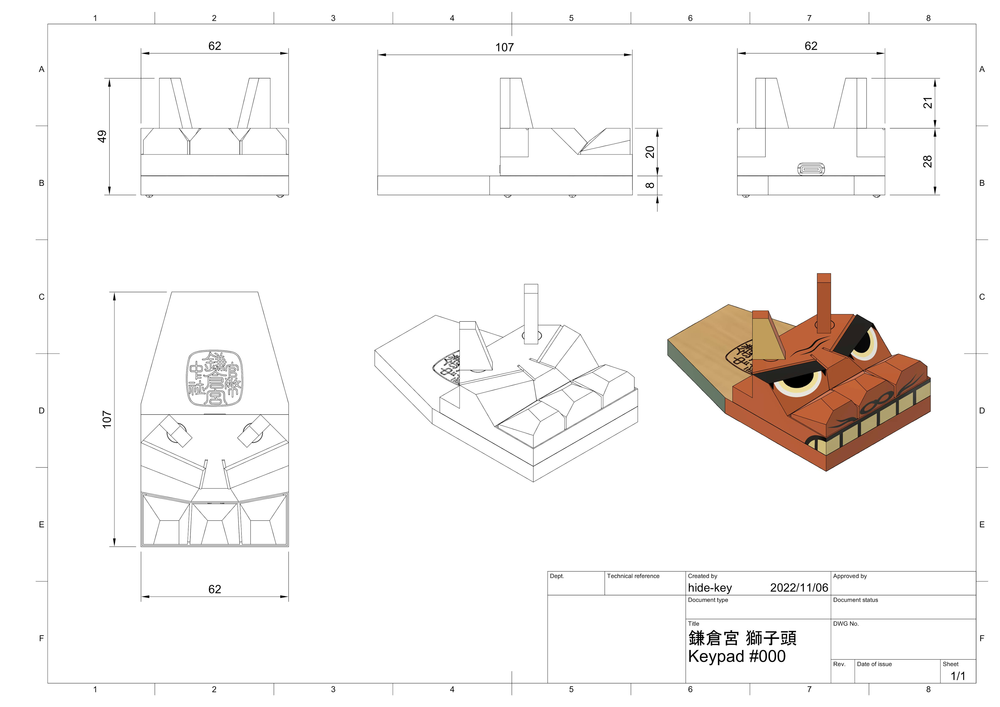
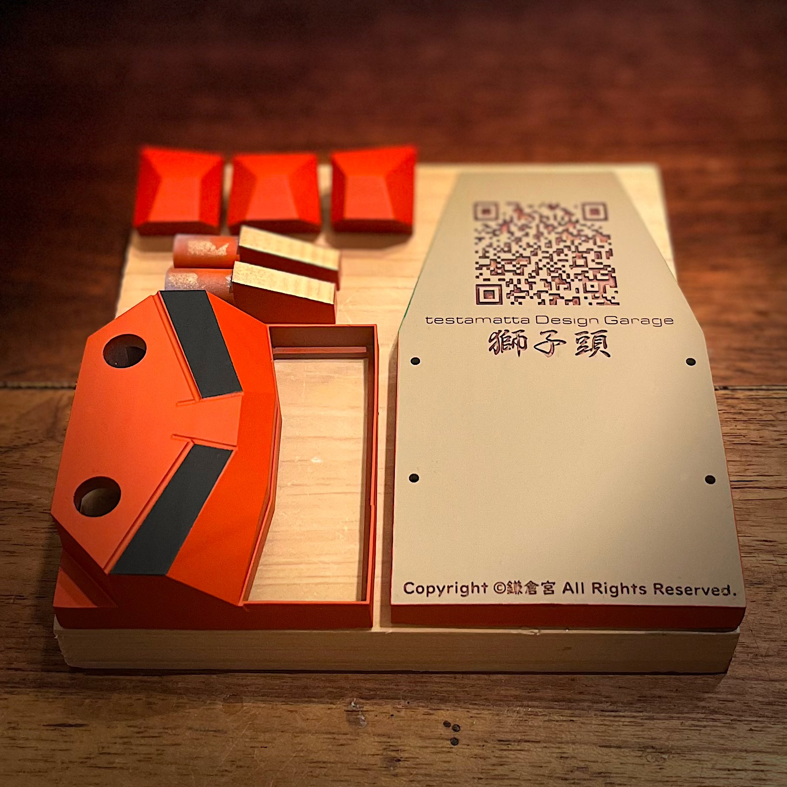
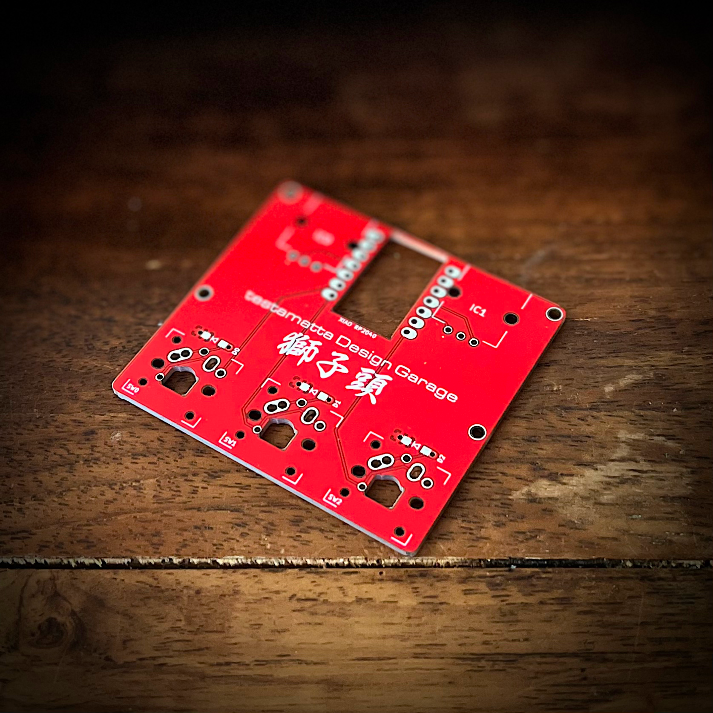
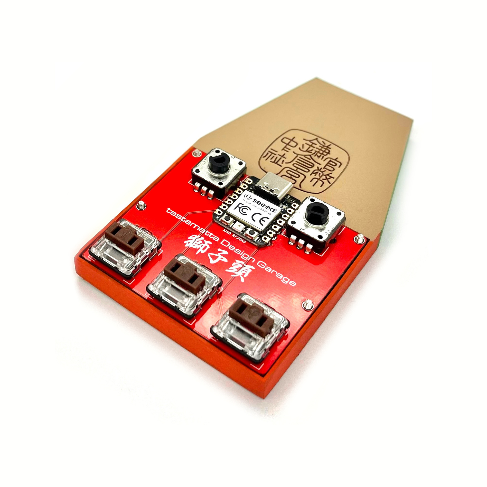

# 鎌倉宮 獅子頭 #000 XIAO RP2040 ビルドガイド

***English version is [here](buildguide_lion_head_000_en.md).**

[TOC]

[神社](https://ja.wikipedia.org/wiki/%E7%A5%9E%E7%A4%BE)([Shinto shrine](https://en.wikipedia.org/wiki/Shinto_shrine)とは、日本固有の宗教である[神道](https://ja.wikipedia.org/wiki/%E7%A5%9E%E9%81%93)([Shinto](https://en.wikipedia.org/wiki/Shinto))の信仰に基づく祭祀施設です。それぞれの神社で、さまざまなお守りなどが存在しており、その神社のひとつである[鎌倉宮](https://ja.wikipedia.org/wiki/%E9%8E%8C%E5%80%89%E5%AE%AE)([Kamakura-gū](https://en.wikipedia.org/wiki/Kamakura-g%C5%AB))のお守りが我が家にもあります。

ある日、「何か面白いネタはないかなぁ〜🤔」と部屋の中を見回していました。「あれ？このお守りの鼻の部分、キーキャップに見える」という、自作キーボードを触り始めると、いろいろなものがキーボードに見えるという病になっていました。😅

それが、今回のモチーフである獅子頭のお守りです。

<u>※獅子頭とは[獅子舞](https://en.wikipedia.org/wiki/Lion_dance)の頭を指します。獅子舞とは東アジアおよび東南アジアでみられる伝統芸能の一つで、[祭囃子](https://ja.wikipedia.org/wiki/祭囃子)にあわせて[獅子](https://ja.wikipedia.org/wiki/狛犬)([Komainu](https://en.wikipedia.org/wiki/Komainu))が舞い踊るものです。</u>

早速、3Dプリントでプロトタイプに着手しましたが、モチーフである獅子頭はお守りです。承諾のないまま完成させるわけにはいかないと思いました。そこで、プロトタイプが完成後、鎌倉宮の[宮司](https://ja.wikipedia.org/wiki/%E5%AE%AE%E5%8F%B8)様にアポイントメントを取って、直々にお会いして「獅子頭のお守りを自作キーボードとして製作して良いでしょうか？」と、いろいろと話をさせて頂くとともに、いろいろな話を聞かせて頂きました。結論としては、ご快諾を頂くことができ、本格的な製作に着手した次第です。

## ■デザイン

この獅子頭のお守りは数種類あるのですが、主に参考とするのは大サイズにしました。

まずは、シルエット情報を得る為に、今回は[Photogrammetry](https://en.wikipedia.org/wiki/Photogrammetry)([写真測量法](https://ja.wikipedia.org/wiki/%E5%86%99%E7%9C%9F%E6%B8%AC%E9%87%8F%E6%B3%95))にて3Dスキャンを使用しました。スマートフォンでスキャンを行ったのと、スキャン対象物が小サイズだったのもあり、かなり粗くなってしまいました。しかし、おおよそのシルエット情報は得られたので十分です。その他として、ネットで[画像検索](https://www.google.com/search?q=%E7%8D%85%E5%AD%90%E9%A0%AD+%E3%81%8A%E5%AE%88%E3%82%8A&tbm=isch&ved=2ahUKEwi5k_WB-s_7AhVWxGEKHa5pA2IQ2-cCegQIABAA&oq=%E7%8D%85%E5%AD%90%E9%A0%AD&gs_lcp=CgNpbWcQARgBMgQIIxAnMgQIIxAnMgUIABCABDIFCAAQgAQyBQgAEIAEMgUIABCABDIFCAAQgAQyBQgAEIAEMgUIABCABDIFCAAQgARQAFgAYL0SaABwAHgAgAFNiAFNkgEBMZgBAKoBC2d3cy13aXotaW1nwAEB&sclient=img&ei=kC2EY7mLC9aIhwOu042QBg&bih=809&biw=1470)をおこない、シルエット情報を補完しました。

最終的なサイズは、キースイッチとロータリーエンコーダのサイズに合わせてデザインしました。

## ■必要なパーツ

下記のパーツを準備して下さい。

|         Name         |       Model        | Quantity |
| :------------------: | :----------------: | :------: |
|         MCU          |    XIAO RP2040     |  1 pcs   |
|     キースイッチ     | Kailh Low Profile  |  3 pcs   |
|      ダイオード      |       1N4148       |  3 pcs   |
| ロータリーエンコーダ |    EC12E2440301    |  2 pcs   |
|         ネジ         |      M2 10mm       |  4 pcs   |
|    クッションゴム    | 7.9x2.2mm Circular |  4 pcs   |

※ダイオードは、スルーホールでもSMDでも問題はありません。

## ■3Dデータ

下記にモデルデータ(STL)があります。

- **STLデータ :** https://github.com/hide-key/testamatta/tree/main/lion_head/model_data/stl

   

## ■3Dプリント

前述の3Dデータをプリントします。私は光造形方式(SLA)にて行いました。プリントサービスを利用するのも良いかもしれません。

 

## ■塗装

塗装は好みで行ってください。私の行った塗装は「サーフェイサー→研ぎ→サーフェイサー→塗装色→つや消しクリア」が基本的な手順です。

## ■回路基板データ

下記にガーバーファイルがあります。PCB製造サービスに発注してください。

- **ガーバーファイル :** https://github.com/hide-key/testamatta/blob/main/lion_head/pcb/lion_head_000.zip

## ■ファームウェア

下記にUF2ファイル、JSONファイル、ソースファイルがあります。

- **UF2 file :** https://github.com/hide-key/testamatta/blob/main/lion_head/uf2/testamatta_lion_head_000_xiao_rp2040_default.uf2
- **JSON file :** https://github.com/hide-key/testamatta/blob/main/lion_head/json/lion_head_000_xiao_rp2040.json
- **Source files :** https://github.com/hide-key/testamatta/tree/main/lion_head/000/xiao_rp2040

 UF2ファイルを使用する場合、XIAO RP2040をブートローダーモードで起動させて、ダウンロードしたUF2ファイルをアップロードします。

 ※XIAO RP2040と作業用のPCをUSBケーブルで接続して、BOOTボタンを押しながらRESETボタンを押します。 ドライブとして認識されるので、UF2ファイルをドラッグアンドドロップしてください。アップロードすると、マウント解除され、自動的に再接続されます。

あとは、[**REMAP**](https://remap-keys.app/)を使用して好みのキーマップにしてください。

## ■組み立て

 回路基板の組み立てを行い、その他のパーツ類を装着していきます。

ロータリーエンコーダになる耳の軸穴が小さいかもしれません。軸穴が小さい場合は、テーパーリーマーで少しだけ拡げてください。

**注意点：**

- XIAO RP2040は、PCBに直付けで設計しています。(ピンヘッダやコンスルーは使用しません) 

## ■完成

ファームウェアの書き込み、組み立てが完了したら完成です。

## ■最後に

下記のSNSにも投稿をしております。 

- **Twitter** : https://twitter.com/nakahide2nd/status/1609593832911536129?s=20&t=q5LzWc66tWL6_BrWK2t76A
- **Instagram** : https://www.instagram.com/p/Cm4UbsKvuOh/?utm_source=ig_web_copy_link
- **Reddit** : [https://www.reddit.com/r/MechanicalKeyboards/comments/100nt7v/鎌倉宮_獅子頭kamakuragū_lion_head_000_xiao_rp2040i/?utm_source=share&utm_medium=web2x&context=3](https://www.reddit.com/r/MechanicalKeyboards/comments/100nt7v/鎌倉宮_獅子頭kamakuragū_lion_head_000_xiao_rp2040i/?utm_source=share&utm_medium=web2x&context=3)
- **instructables** : [https://www.instructables.com/Keypad鎌倉宮-獅子頭Kamakura-gū-Lion-Head-000-XIAO-RP2040/](https://www.instructables.com/Keypad鎌倉宮-獅子頭Kamakura-gū-Lion-Head-000-XIAO-RP2040/)

この度、唐突な申し出にもかかわらず、ご理解とご快諾を頂いた鎌倉宮の関係者の皆様には心より御礼を申し上げます。

 最後まで読んで頂きありがとうございました。

良きキーボードライフを。
