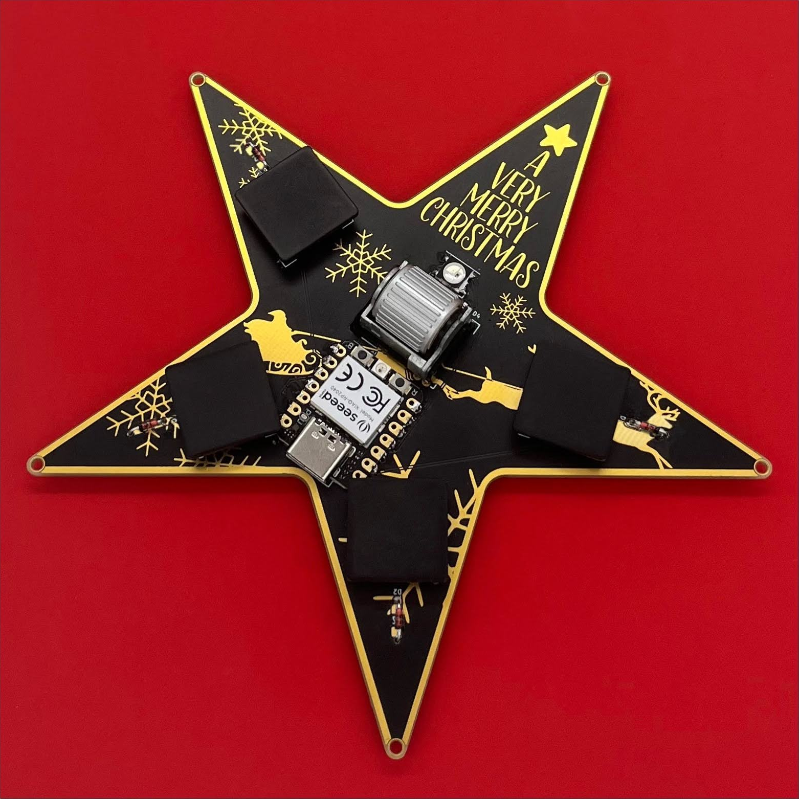
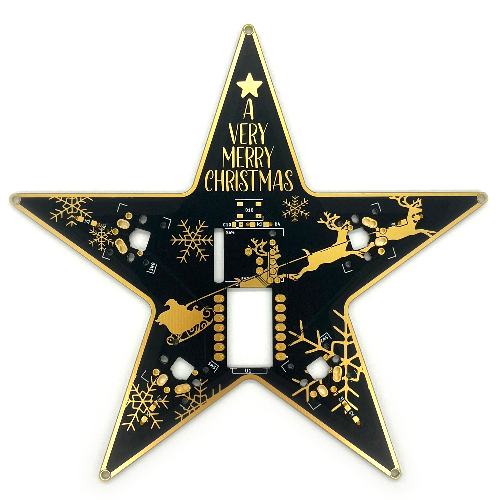
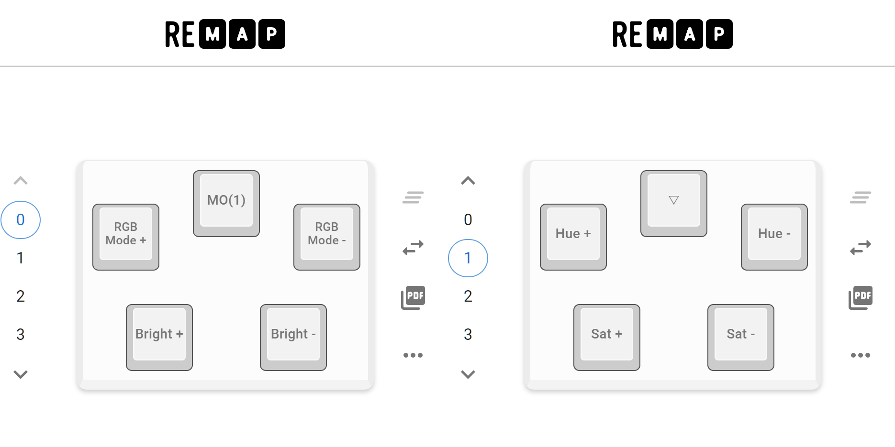
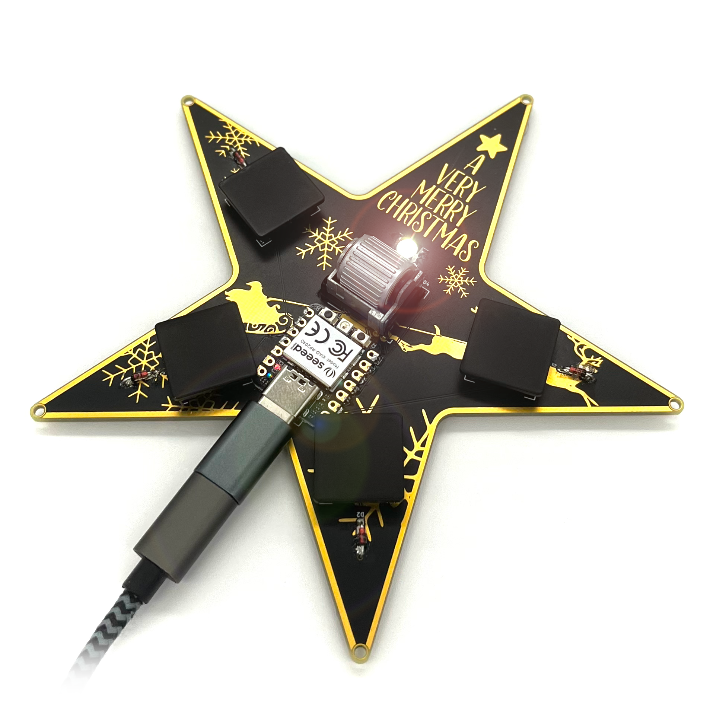

# MacroPad #000 XIAO RP2040 ビルドガイド

*English version is [here](https://github.com/hide-key/testamatta/blob/main/macropad/macropad_000_xiao_rp2040_en.md).

[TOC]

クリスマスのオーナメントを模したキーパッドです。

## ■デザイン

図柄についてはフリー素材を使用していますが、商用利用不可な素材が含まれております。ご注意ください。

- **ロゴ :** https://freesvgdesigns.com/a-very-merry-christmas-free-svg-files-1489/ (商用利用不可)
- **星 :** https://www.freesvgdownload.com/christmas-tree-svg-png-free-christmas-cut-files/ (商用利用不可)
- **雪の結晶 :** https://www.freesvgdownload.com/snowflakes-svg-png-free-christmas-cut-files/ (商用利用不可)
- **サンタのソリ :** https://www.craftingspree.com/free-cricut-christmas-svgs-1 (商用利用可)

※ラピッドプロトタイプを目的として製作したので、上記の素材を利用・流用した次第。

※外形の星型はオリジナルです。

## ■必要なパーツ

下記のパーツを準備してください。

|           名称           |                  型番                   |  数量  |
| :----------------------: | :-------------------------------------: | :----: |
|           MCU            |               XIAO RP2040               | 1 pcs  |
|       キースイッチ       |             Kailh X Switch              | 4 pcs  |
|        ダイオード        |                 1N4148                  | 5 pcs  |
| 水平ロータリーエンコーダ |                EVQWGD001                | 1 pcs  |
|        コンデンサ        | TMK212F104ZQ-T (SMD, 0.1μF, 25V, 2012M) | 1 pcs  |
|           LED            |                WS2812B-B                | 1 pcs  |
|      クッションゴム      |             7.9x2.2mm 丸形              | ５ pcs |

※キースイッチは、Kailh Low ProfileやCherry MXも使用できます。ソケットには対応してません。X Switch以外の場合、別途、キーキャップを用意してください。(私は、キーキャップがセットになったキースイッチを購入しました)

※ダイオードは、SMDも使用できます。

※コンデンサとLEDはSMDのみ使用可です。

※クッションゴムは、好みのサイズでも問題ありません。

## ■回路基板データ

下記にガーバーファイルがあります。PCB製造サービスに発注してください。

- **ガーバーファイル :** https://github.com/hide-key/testamatta/blob/main/macropad/pcb/macropad_000f.zip

  

  

  

## ■組み立て

コンデンサとLEDは、SMD仕様にしてありますので、慎重に作業してください。

その他のパーツはスルーホールなので、通常のハンダ付けの要領で進められます。

**注意点：**

- XIAO RP2040は、PCBに直付けで設計しています。(ピンヘッダやコンスルーは使用しません)
- ダイオードの向きが判別し難い箇所があります。星型の外側方向にダイオードの帯が来るようにして下さい。水平ロータリーエンコーダ上部のダイオードは左側に帯がくるようにしてください。
- 個人的に最も苦労したのは、水平ロータリーエンコーダを組み込むコツが分からなかった点です。慎重かつ大胆にアプローチしてください。(実は1個壊しました…)

## ■ファームウェア

下記にUF2ファイル、JSONファイル、ソースファイルがあります。

- **UF2ファイル :** https://github.com/hide-key/testamatta/blob/main/macropad/uf2/testamatta_macropad_000_xiao_rp2040_default.uf2
- **JSONファイル :** https://github.com/hide-key/testamatta/blob/main/macropad/json/macropad_000_xiao_rp2040.json
- **ソースファイル :** https://github.com/hide-key/testamatta/tree/main/macropad/000/xiao_rp2040

UF2ファイルを使用する場合、XIAO RP2040をブートローダーモードで起動させて、ダウンロードしたUF2ファイルをアップロードします。

※XIAO RP2040と作業用のPCをUSBケーブルで接続して、BOOTボタンを押しながらRESETボタンを押します。 ドライブとして認識されるので、UF2ファイルをドラッグアンドドロップしてください。アップロードすると、マウント解除され、自動的に再接続されます。

あとは、[**REMAP**](https://remap-keys.app/)を使用して好みのキーマップにしてください。

下記の画像は、デフォルトのキーマップ(レイヤー0＆1)です。見れば分かる通り、もはやキーパッドではなく、イルミネーション機能だけをマッピングした単なるオーナメント状態ですｗ

## ■完成

ファームウェアをインストールした後、再接続した状態でLED(WS2812B-B)が点灯・点滅すれば正常です。REMAPでの編集も可能です。

これで完成となります。

## ■最後に

下記のSNSにも投稿をしております。

- **Twitter :** 準備中
- **Reddit :** 準備中
- **instructables :** 準備中

最後まで読んで頂きありがとうございました。

良きキーボードライフを。