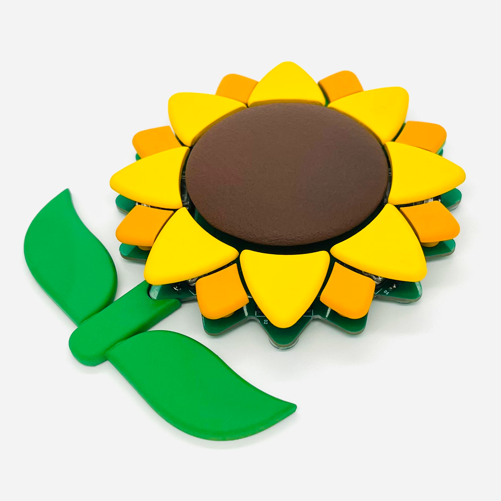
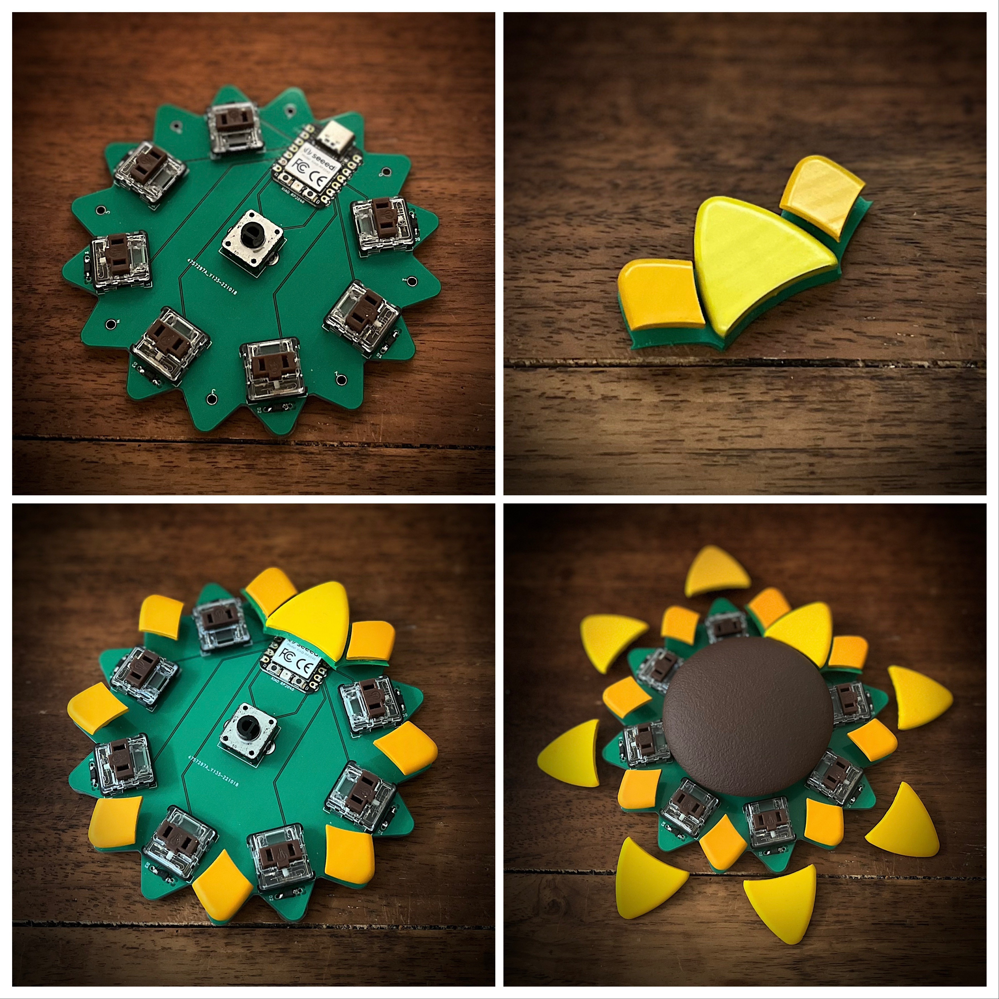
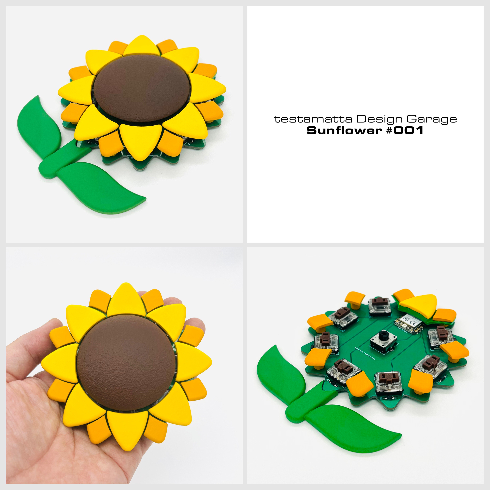

# Sunflower #001 Build Guide

*I am using a translation tool. Please contact me if you have any problems.

※日本語版は[コチラ](https://github.com/hide-key/testamatta/blob/main/sunflower/buildguide_sunflower_001_jp.md)

[TOC]

When I saw [banana](https://github.com/dbostian/bananasplit) and [corn](https://www.reddit.com/r/MechanicalKeyboards/comments/xwddp5/ic_spring_2023_iowa_mechanical_keyboard_meetup_ic/) keyboards, I thought, "I want to make something." When I was talking to my family, they said, "How about sunflowers?" I replied, "Huh? Sunflowers!?" Again, I thought, "Sunflowers...".

Search for sunflowers. At first, I imagined a realistic sunflower, but many of the designs were simplified like icons, so I thought I might be able to make one.

## ■Supplies

Prepare the following parts.

|      Name      |                            Model                             | Quantity |
| :------------: | :----------------------------------------------------------: | :------: |
|      MCU       |                         XIAO RP2040                          |  1 pcs   |
|   Key switch   |                      Kailh Low Profile                       |  7 pcs   |
|     Diode      |                            1N4148                            |  7 pcs   |
| Rotary encoder |                         EC12E2440301                         |  1 pcs   |
|     Screw      |                            M2 8mm                            |  8 pcs   |
| Cushion rubber | [7.9x2.2mm Circular](https://www.amazon.co.jp/gp/product/B00V5MQQB4/ref=ppx_yo_dt_b_search_asin_title?ie=UTF8&psc=1) | 4～8 pcs |

*It does not matter if the diode is through-hole or SMD. (supports both)

## ■3D data

The model data (STEP, STL) are shown below.

- **STEP data :** https://github.com/hide-key/testamatta/tree/main/sunflower/model_data/step
- **STL data :** https://github.com/hide-key/testamatta/tree/main/sunflower/model_data/stl

The features of each part are as follows.

|   Name    | Quantity |                             Memo                             |
| :-------: | :------: | :----------------------------------------------------------: |
| petal_A_1 |    1     | The petals at the top (above the MCU). It is assumed that it is attached to the bridge part so as not to interfere with the USB connector. The petals themselves are 2mm thick. I don't need the keycap function, so I don't put a stem on it. |
| petal_A_2 |    7     | Flower petals that become key caps. The thickness of the petals is 2 mm. Attach [Stem part](https://github.com/ogatatsu/Kailh-Low-Profile-Keycap) to the petal. |
|  petal_B  |    8     | The petal to place behind petal_A. Thickness is 2mm. Add a cylinder leg and drill a 1.8mm hole for screwing. |
|  bridge   |    1     | Parts that connect petal_A_1 on the top of the MCU and petal_B on the left and right. It is assumed that it will be fixed using an adhesive. |
|   dial    |    1     | Knob of a rotary encoder. Shrink the sphere vertically and slice it in half. Make a leg that connects to the encoder and make a hole that matches the shaft. |
|   stem    |    1     | The thickness is 3.8mm (circuit board 1.6mm + cushion rubber 2.2mm). In this design, it is assumed that it will not be connected and placed as a decoration. :D |

## ■3D printing

Print the aforementioned 3D data. I output with the stereolithography method (SLA). You may also want to use a print service.

## ■Painting

Paint as desired. The basic procedure for the painting I did was "Surfacer → File → Surfacer → Paint color → Matte clear".

For the dial part, a [chipping coat (spray)](https://www.amazon.co.jp/%E3%82%A4%E3%83%81%E3%83%8D%E3%83%B3%E3%82%B1%E3%83%9F%E3%82%AB%E3%83%AB%E3%82%BA-Ichinen-Chemicals-%E5%87%B8%E5%87%B9%E8%80%90%E3%83%81%E3%83%83%E3%83%94%E3%83%B3%E3%82%B0%E5%A1%97%E6%96%99-NX83/dp/B07B5ZDK45/ref=d_pd_sbs_sccl_3_1/358-6891682-7837701?pd_rd_w=MiJAe&content-id=amzn1.sym.ca864c39-ce73-4598-86c6-eb8514722510&pf_rd_p=ca864c39-ce73-4598-86c6-eb8514722510&pf_rd_r=AR4HY0YMWH0V6AFB5BVM&pd_rd_wg=FXy3f&pd_rd_r=97157b76-af36-4676-aabe-f0bf5b60a9e5&pd_rd_i=B07B5ZDK45&th=1) is used between the base and the paint color to give it a rough texture so that it does not slip when turned.

*There were only the above image, the photo before applying matte clear.

## ■Circuit board data

Below is the gerber file. Place your order with PCB Fabrication Services.

- **Gerber file :** https://github.com/hide-key/testamatta/blob/main/sunflower/pcb/sunflower_001a.zip

  

## ■Firmware

Below are UF2 file, JSON file, and source files.

- **UF2 file :** https://github.com/hide-key/testamatta/blob/main/sunflower/uf2/testamatta_sunflower_000_xiao_rp2040_default.uf2
- **JSON file :** https://github.com/hide-key/testamatta/blob/main/sunflower/json/sunflower_000_xiao_rp2040.json
- **Source files :** https://github.com/hide-key/testamatta/tree/main/sunflower/000/xiao_rp2040

If you want to use UF2 file, boot XIAO RP2040 in bootloader mode and upload the downloaded UF2 file.

*Connect the XIAO RP2040 and the work PC with a USB cable, and press the RESET button while pressing the BOOT button. It will be recognized as a drive, so drag and drop the UF2 file. Once uploaded, it will be unmounted and reconnected automatically.

After that, use [**REMAP**](https://remap-keys.app/) to make your favorite keymap.

## ■Assembling

After assembling the circuit board and keyboard parts, we will install other parts.

**Points to note：**

- XIAO RP2040 is designed to be directly attached to the PCB. (No pin headers or cons throughs are used)

- Glue Petal_A_1 and Petal_B on top of XIAO RP2040 to the bridge parts as shown in the above photo.

  

## ■Completing

Once the assembly is complete, place the leafs and you are done.

## ■At the end

I am also posting on the following SNS.

- **[Twitter](https://twitter.com/nakahide2nd/status/1586337926232694784?s=20&t=6Jq-9BXEgQ14RIv-VRTCxg)**  *This keypad post.
- **[Reddit](https://www.reddit.com/user/hide-key/)** *Various posts including this keypad.
- **[instructables](https://www.instructables.com/Original-KeypadSunflower-001-XIAO-RP2040-Newly-Des/)** : *This keypad post. There are also other posts.

Thank you very much for reading to the end.

Have a nice keyboard life.