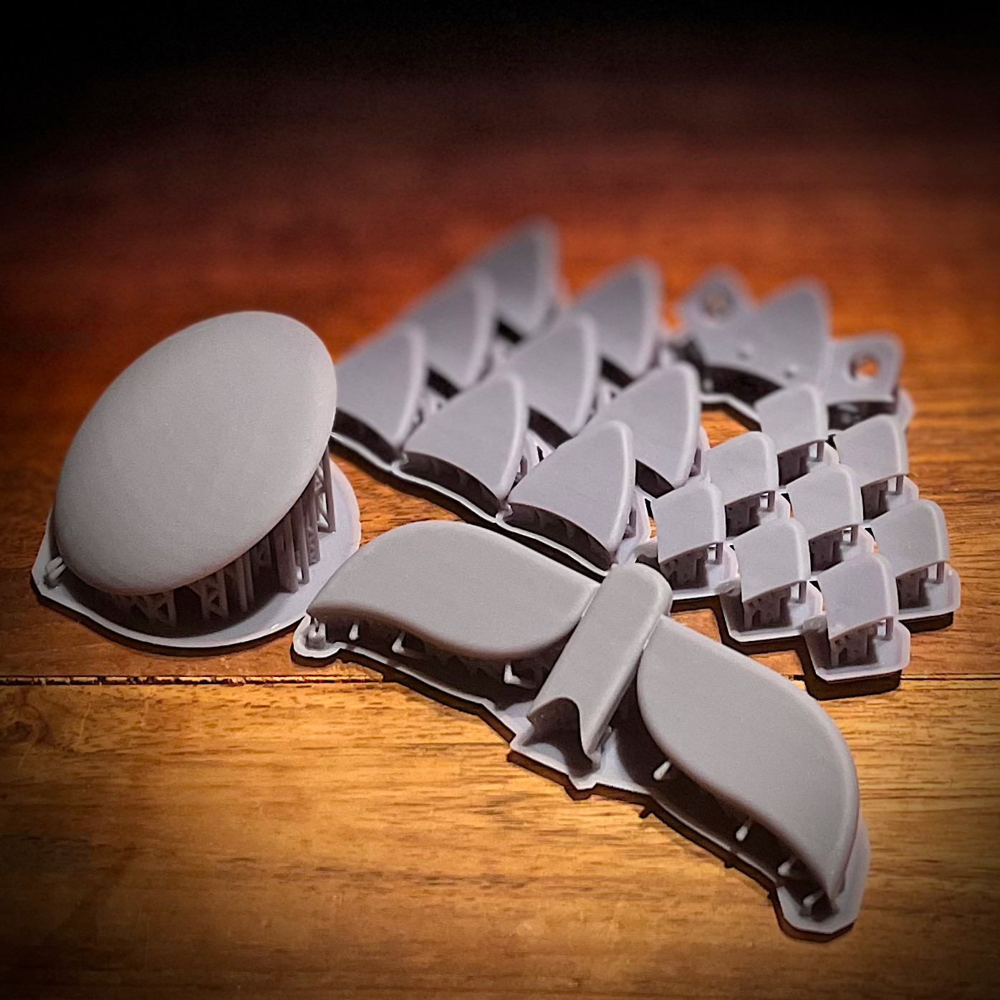
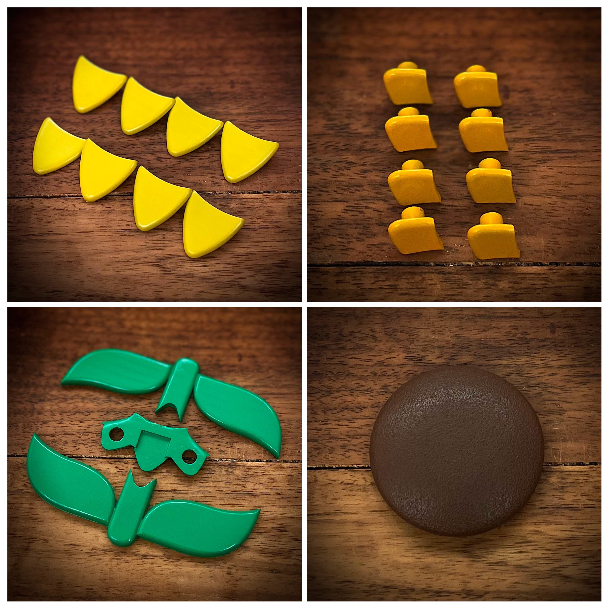
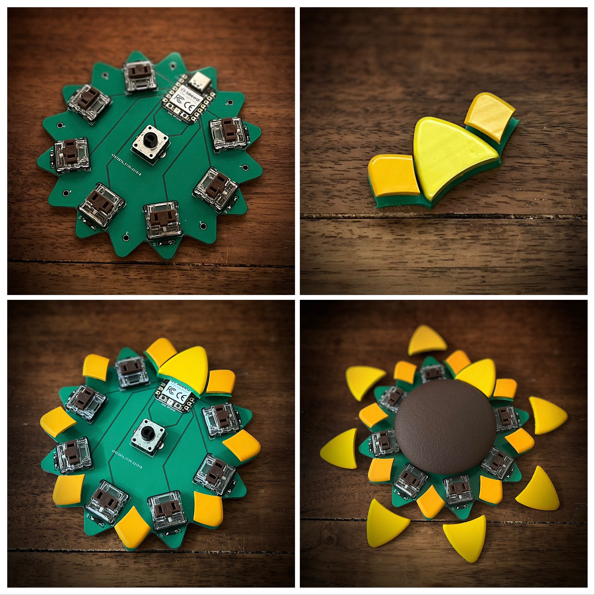
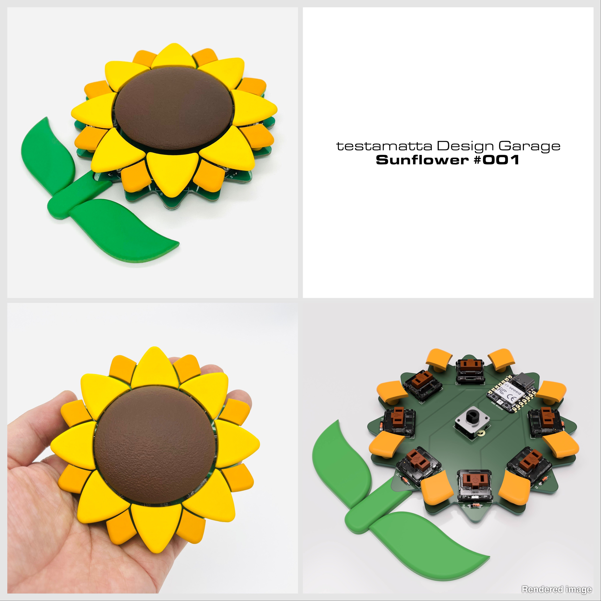

# Sunflower #001 ビルドガイド

*English version is [here](https://github.com/hide-key/testamatta/blob/main/sunflower/buildguide_sunflower_001_en.md).

[TOC]

[バナナ](https://github.com/dbostian/bananasplit)や[トウモロコシ](https://www.reddit.com/r/MechanicalKeyboards/comments/xwddp5/ic_spring_2023_iowa_mechanical_keyboard_meetup_ic/)のキーボードを見て、私も「何か作りたい」と思い、家族と話をしていたところ「ヒマワリはどう？」と言われ、私は「え？ヒマワリ!?」と思いました。「ヒマワリですか…困」と。

早速、ヒマワリを検索。当初はリアルなヒマワリを想像していたのですが、アイコンのように簡略化されたデザインが多く、これならば作れるかもと思った次第。

## ■デザイン

3Dデータ自体は、Fusion360を使用してオリジナルで作ったのですが、完成した結果、検索時のアイコンデザインに脳内が引っ張られていたようで、あまりにも酷似していたこともあり、このデザインを参照したということにします。

- **花の部分 :** https://www.svgrepo.com/svg/149542/sunflower 

- **葉っぱ＆茎の部分 :** https://www.svgrepo.com/svg/407548/sunflowe

  

SVGデータを3Dソフトにインポートができれば、あとは立体化して、キーボード化するという感じです。

キーキャップ部分の作成方法は、[この記事](https://kbd.news/Homemade-keycaps-1643.html)でも紹介して頂きましたが、これまでの実績として下記のステム部分のデータが、キースイッチ(Kailh Low Profile)との相性が最も良かったです。

- **ステム部分 :** https://github.com/ogatatsu/Kailh-Low-Profile-Keycap

上記が基本的なデザイン要素になります。

## ■必要なパーツ

下記のパーツを準備して下さい。

|         名称         |                             型番                             |   数量   |
| :------------------: | :----------------------------------------------------------: | :------: |
|         MCU          |                         XIAO RP2040                          |  1 pcs   |
|     キースイッチ     |                      Kailh Low Profile                       |  7 pcs   |
|      ダイオード      |                            1N4148                            |  7 pcs   |
| ロータリーエンコーダ |                         EC12E2440301                         |  1 pcs   |
|         ねじ         |                            M2 8mm                            |  8 pcs   |
|    クッションゴム    | [7.9x2.2mm 丸形](https://www.amazon.co.jp/gp/product/B00V5MQQB4/ref=ppx_yo_dt_b_search_asin_title?ie=UTF8&psc=1) | 4～8 pcs |

※ダイオードは、スルーホールでも問題はありません。

## ■3Dデータ

下記にモデルデータ(STEP、STL)があります。

- **STEPデータ :** https://github.com/hide-key/testamatta/tree/main/sunflower/model_data/step
- **STLデータ :** https://github.com/hide-key/testamatta/tree/main/sunflower/model_data/stl

各パーツは、下記のようになってます。

|   名称    | 数量 |                             メモ                             |
| :-------: | :--: | :----------------------------------------------------------: |
| petal_A_1 |  1   | 最上部(MCUの上)の花びら。USBコネクタと干渉しないように、bridgeパーツと接着させることを前提とします。花びら自体の厚みは2mm。キーキャップの機能は設けないので、ステムは付けません。 |
| petal_A_2 |  7   | キーキャップになる花びら。花びらの厚みは2mm。その花びらに[ステムパーツ](https://github.com/ogatatsu/Kailh-Low-Profile-Keycap)を取り付けます。 |
|  petal_B  |  8   | petal_Aの後ろに配置する花びら。厚みは2mm。円柱の脚を付け、ネジ止め用として1.8mmの穴を開けます。 |
|  bridge   |  1   | MCU上に配置するpetal_A_1と、その左右にあるpetal_Bを繋げるパーツ。接着剤を使って固定することを前提としています。 |
|   dial    |  1   | ロータリーエンコーダのノブ。球体を潰し、半分にスライス。エンコーダと接続する脚を作り、穴を開けます。 |
|   stem    |  1   | 厚みは3.8mm(回路基板 1.6mm＋クッションゴム 2.2mm)。今回のデザインでは連結はさせず、飾りとして置く感じです。 |

## ■3Dプリント

前述の3Dデータをプリントします。私は光造形方式(SLA)にて行いました。プリントサービスを利用するのも良いかもしれません。

## ■塗装

塗装は好みで行ってください。私の行った塗装は「サーフェイサー→研ぎ→サーフェイサー→塗装色→つや消しクリア」が基本的な手順です。

ダイヤル部分については、回す時に滑らないように、下地と塗装色の間に[チッピングコート(スプレー)](https://www.amazon.co.jp/%E3%82%A4%E3%83%81%E3%83%8D%E3%83%B3%E3%82%B1%E3%83%9F%E3%82%AB%E3%83%AB%E3%82%BA-Ichinen-Chemicals-%E5%87%B8%E5%87%B9%E8%80%90%E3%83%81%E3%83%83%E3%83%94%E3%83%B3%E3%82%B0%E5%A1%97%E6%96%99-NX83/dp/B07B5ZDK45/ref=d_pd_sbs_sccl_3_1/358-6891682-7837701?pd_rd_w=MiJAe&content-id=amzn1.sym.ca864c39-ce73-4598-86c6-eb8514722510&pf_rd_p=ca864c39-ce73-4598-86c6-eb8514722510&pf_rd_r=AR4HY0YMWH0V6AFB5BVM&pd_rd_wg=FXy3f&pd_rd_r=97157b76-af36-4676-aabe-f0bf5b60a9e5&pd_rd_i=B07B5ZDK45&th=1)を使用して、ザラつきを出しています。

※上記画像、つや消しクリアを塗布する前の写真しかありませんでした。

## ■回路基板データ

下記にガーバーファイルがあります。PCB製造サービスに発注してください。

- **ガーバーファイル :** https://github.com/hide-key/testamatta/blob/main/sunflower/pcb/sunflower_001a.zip

  

## ■ファームウェア

下記にUF2ファイル、JSONファイル、ソースファイルがあります。

- **UF2ファイル :** https://github.com/hide-key/testamatta/blob/main/sunflower/uf2/testamatta_sunflower_000_xiao_rp2040_default.uf2
- **JSONファイル :** https://github.com/hide-key/testamatta/blob/main/sunflower/json/sunflower_000_xiao_rp2040.json
- **ソースファイル :** https://github.com/hide-key/testamatta/tree/main/sunflower/000/xiao_rp2040

UF2ファイルを使用する場合、XIAO RP2040をブートローダーモードで起動させて、ダウンロードしたUF2ファイルをアップロードします。

※XIAO RP2040と作業用のPCをUSBケーブルで接続して、BOOTボタンを押しながらRESETボタンを押します。 ドライブとして認識されるので、UF2ファイルをドラッグアンドドロップしてください。アップロードすると、マウント解除され、自動的に再接続されます。

あとは、[**REMAP**](https://remap-keys.app/)を使用して好みのキーマップにしてください。

## ■組み立て

回路基板の組み立てを行い、その他のパーツ類を装着していきます。

**注意点：**

- XIAO RP2040は、PCBに直付けで設計しています。(ピンヘッダやコンスルーは使用しません)
- XIAO RP2040の上に来るPetal_A_1とPetal_Bは、上記の写真のように、bridgeパーツにて接着させて下さい。

## ■完成

組み立てが完了したら、葉っぱを添えて、完成となります。

## ■最後に

下記のSNSにも投稿をしております。

- **[Twitter](https://twitter.com/nakahide2nd/status/1586337926232694784?s=20&t=6Jq-9BXEgQ14RIv-VRTCxg)** ※このキーパッドの投稿です。
- **[Reddit](https://www.reddit.com/user/hide-key/)** ※このキーパッドを含む、自作キーボードの投稿です。
- **[instructables](https://www.instructables.com/Original-KeypadSunflower-001-XIAO-RP2040-Newly-Des/)** ※このキーパッドの投稿。その他の投稿もあります。

最後まで読んで頂きありがとうございました。

良きキーボードライフを。